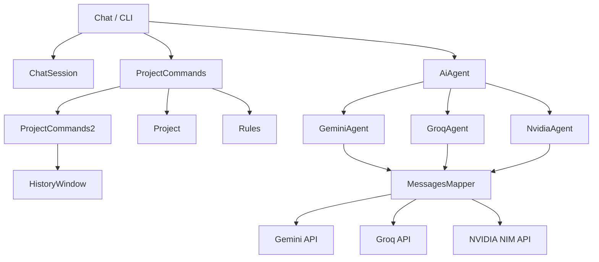

# AI Project Tracker

A Java command-line AI workspace for chatting with multiple AI providers while keeping project notes, conversation history, file attachments, token-aware summaries, and session rules in one place.

The application currently supports **Google Gemini**, **Groq-hosted GPT-OSS and Qwen models**, and **NVIDIA Nemotron** through a shared `AiAgent` interface. Groq and NVIDIA responses can be streamed directly to the console.

> **Project status:** active development. The CLI is the primary interface. A Swing history viewer is available, while the full `ChatWindow` GUI is not implemented yet.

---

## Features

- Multi-provider AI chat through one common interface
- Gemini, GPT-OSS, Qwen, and Nemotron model options
- Streaming output for Groq and NVIDIA responses
- Token usage tracking from provider responses
- Manual and automatic conversation summarization
- Project tracking with status and notes
- File attachments using Base64 encoding
- Saved chat history with reload support
- Automatic plain-text chat autosaves
- Configurable per-session rules
- Read-only Swing windows for current and full conversation history
- Local runtime data separated under the `data/` directory
- API keys loaded from environment variables rather than source code

---

## Tech Stack

| Component | Technology |
|---|---|
| Language | Java 25 |
| Build tool | Maven |
| JSON | Jackson Databind 2.22.1 |
| HTTP | Java `HttpClient` |
| Desktop UI | Swing |
| Persistence | Local JSON / text files |
| AI APIs | Google Gemini, Groq, NVIDIA NIM |

No provider SDK is required. API requests are built and sent directly with Java's standard HTTP client.

---

## Supported AI Models

The current model selection in `Chat.java` is:

| CLI option | Display name | Provider | Model |
|---:|---|---|---|
| `0` | Gemini | Google Gemini API | `gemini-3.5-flash` |
| fallback | Gemini Lite | Google Gemini API | `gemini-3.5-flash-lite` |
| `1` | ChatGPT | Groq | `openai/gpt-oss-120b` |
| `2` | Qwen | Groq | `qwen/qwen3.8-27b` |
| `3` | Nemotron | NVIDIA NIM | `nvidia/nemotron-3-ultra-550b-a55b` |

> **Note:** option `1` is currently displayed as `ChatGPT` in the CLI, but the application is not calling the ChatGPT product or OpenAI API. It uses the open-weight `openai/gpt-oss-120b` model through Groq.

Model IDs are currently configured directly in source code and may need to be updated if a provider changes model availability.

---

## Requirements

- **JDK 25**
- **Apache Maven**
- Internet connection
- At least one API key for the provider you want to use

The Maven project currently targets Java 25:

```xml
<maven.compiler.source>25</maven.compiler.source>
<maven.compiler.target>25</maven.compiler.target>
```

---

## API Keys

The application reads provider credentials from environment variables.

| Provider | Environment variable |
|---|---|
| Gemini | `GEMINI_API_KEY` |
| Groq | `GROQ_API_KEY` |
| NVIDIA | `NVIDIA_API_KEY` |

### Windows PowerShell

For the current terminal session:

```powershell
$env:GEMINI_API_KEY="your-key"
$env:GROQ_API_KEY="your-key"
$env:NVIDIA_API_KEY="your-key"
```

For persistent Windows environment variables:

```powershell
setx GEMINI_API_KEY "your-key"
setx GROQ_API_KEY "your-key"
setx NVIDIA_API_KEY "your-key"
```

Open a new terminal after using `setx`.

### macOS / Linux

```bash
export GEMINI_API_KEY="your-key"
export GROQ_API_KEY="your-key"
export NVIDIA_API_KEY="your-key"
```

You only need the key for the provider you intend to use, except when using file attachments with Groq or NVIDIA. Those attachment paths currently use Gemini as an intermediate file-processing step and therefore also require `GEMINI_API_KEY`.

> Never commit real API keys to GitHub. Keep them in environment variables or another local secrets mechanism.

---

## Installation

Clone the repository:

```bash
git clone https://github.com/782453/ai-project-tracker.git
cd ai-project-tracker
```

Compile/package with Maven:

```bash
mvn clean package
```

The application entry point is:

```text
com.lior.tracker.Chat
```

### IntelliJ IDEA

The simplest development workflow is:

1. Open the repository as a Maven project.
2. Set the Project SDK to **JDK 25**.
3. Let Maven resolve Jackson.
4. Open `src/main/java/com/lior/tracker/Chat.java`.
5. Run `Chat.main()`.

The current `pom.xml` does not configure a shaded/fat JAR, so running directly from the IDE is the easiest option during development.

---

## First Run

At startup the application creates its local runtime directories if they do not already exist:

```text
data/
├── projects.json
├── chatHistory/
├── sendFiles/
└── autoSave/
```

It then displays the model selector:

```text
AI-Project-Tracker
Ai models list:
[0] Gemini
[1] ChatGPT
[2] Qwen
[3] Nemotron
Choose Ai model:
```

After a model is selected, a default session starts with all optional session rules disabled.

When Nemotron is selected, the application also offers the option to add an initial system instruction before the conversation begins.

---

## Commands

Enter:

```text
/?
```

to display the first command page.

### Page 1

| Command | Description |
|---|---|
| `/nchat` | Start a fresh chat session |
| `/nproject` | Create a new tracked project |
| `/projects` | List projects and open project actions |
| `/sprojects` | Save the current project list |
| `/send` | Attach and send a file from `data/sendFiles/` |
| `/paste` | Paste a large multi-line message using `eof` as the delimiter |
| `/summarize` | Summarize the current conversation context |
| `/save` | Save the accumulated chat history |
| `/load` | Load a previously saved chat |
| `/++` | Open command page 2 |

### Page 2

| Command | Description |
|---|---|
| `/history` | Open the active AI context in a Swing history window |
| `/fhistory` | Open the full accumulated session history |
| `/rules` | View or change session rules |
| `/resend` | Resend the most recent pending user message |
| `/exit` | Exit the application |
| `/..` | Return to command page 1 |

---

## Project Tracking

Projects are represented by the `Project` class and stored in:

```text
data/projects.json
```

Each project contains:

```text
name
status
lastUpdated
notes
```

Available statuses are:

```text
ACTIVE
BLOCKED
PAUSED
DONE
```

### Creating a project

Use:

```text
/nproject
```

The application asks for the project name, status, last-updated date, and notes, then saves the updated project list.

### Working with an existing project

Use:

```text
/projects
```

After selecting a project, the current actions are:

| Option | Action |
|---|---|
| `w` | Add the project name and notes to the AI conversation context |
| `c` | Change the project status |
| `a` | Append project notes |
| `DEL` | Delete the selected project |

Selecting `w` lets the AI continue the conversation with the selected project's stored notes already in context.

---

## Chat Messages

All providers share the same internal `ChatMessage` model.

A message can contain:

```text
role
text
inline_data
mimeType
filename
```

The file-related fields are optional and are populated only for attachment messages.

Typical roles are:

```text
user
model
system
```

`MessagesMapper` converts these shared messages into the JSON format required by each provider.

For Groq/NVIDIA-compatible requests, the internal `model` role is converted to `assistant`.

---

## File Attachments

Files to be sent are placed in:

```text
data/sendFiles/
```

Then use:

```text
/send
```

The application:

1. Reads the selected file.
2. Encodes it as Base64.
3. Detects its MIME type with `Files.probeContentType`.
4. Stores the encoded data, MIME type, and filename in a `ChatMessage`.

### Gemini

Gemini receives the text and file as separate message parts using Gemini's `inline_data` structure.

### Groq and NVIDIA

Groq and NVIDIA chat requests are text-based in the current implementation. When the latest message contains a file, the application first sends that message to Gemini, adds Gemini's file interpretation back into the conversation, and then continues with the selected Groq or NVIDIA model.

Because of this bridge, using attachments with Groq or NVIDIA also requires a valid `GEMINI_API_KEY`.

---

## Streaming

Streaming is currently enabled for:

- Groq
- NVIDIA Nemotron

`GroqAgent` and `NvidiaAgent` read the Server-Sent Events response line by line, print each content chunk as it arrives, and collect the chunks into the final `Result` returned to the main chat loop.

Both request builders enable:

```json
"stream": true,
"stream_options": {
  "include_usage": true
}
```

This allows the application to retrieve the final token usage while still displaying the answer progressively.

Gemini currently uses a normal non-streaming response.

---

## Token Tracking

Each provider returns a common:

```java
public record Result(String text, int tokens) {}
```

The `tokens` field stores the provider-reported total token count for the request.

After a completed response the CLI prints the approximate request duration and total token count (`TTC`).

Token usage is also used by the summarization system.

---

## Conversation Summarization

Long conversations resend an increasingly large message list to the provider. AI Project Tracker includes both manual and automatic summarization to reduce that context size.

### Manual summarization

Use:

```text
/summarize
```

Manual summarization is available when the current provider-reported token count is at least **1000**.

The application asks the AI to preserve important information such as:

- facts and user preferences
- decisions already made
- technical details
- class, method, variable, API, and model names
- constraints
- unresolved tasks and questions
- important code details
- recent conversation state

After the summary is returned, the active context is replaced with a much smaller summary-based conversation.

### Automatic summarization

When the `autoSummarize` rule is enabled, the application automatically summarizes the conversation once the session token count reaches **10,000** or more.

Gemini is used for automatic summarization by default. Nemotron sessions use `NvidiaAgent` instead.

---

## Session Rules

Use:

```text
/rules
```

to inspect or edit the current rules.

The current `Rules` class contains three settings:

| Rule | Purpose |
|---|---|
| `maxTokens` | Inject a compact-response instruction designed to minimize unnecessary output tokens |
| `autoSummarize` | Automatically summarize the active context at 10,000+ tokens |
| `autoSave` | Automatically append conversation turns to a local text file |

A new application session starts with all three disabled:

```text
maxTokens: false
autoSummarize: false
autoSave: false
```

### `maxTokens`

When enabled, a prompt is added that asks the model to remove repetition, greetings, filler, and irrelevant content and to answer in a compact format.

For Nemotron this is sent as a `system` message. For the other current providers it is inserted into the conversation as a user/model exchange.

### `autoSave`

Each `Rules` object receives a UUID. When autosave is enabled, conversation turns are appended to:

```text
data/autoSave/<uuid>.txt
```

Autosaves are plain text and separate from manually saved JSON chat histories.

---

## Chat History

The application maintains two related forms of history.

### Active context

`ChatSession.messages` contains the messages currently being sent back to the selected AI provider.

This list may become smaller after summarization or when a new chat is started.

### Full session history

`Chat.msgHistory` accumulates user/model turns separately from the active context.

For attached files, the full history stores a readable filename marker instead of duplicating the Base64 payload.

### History viewer

`HistoryWindow` provides a read-only Swing view for either list:

```text
/history   -> active context
/fhistory  -> full accumulated history
```

Messages are formatted as `YOU`, the current AI name, or `SYSTEM`.

### Saving history

Use:

```text
/save
```

Saved conversations are written as JSON to:

```text
data/chatHistory/
```

Filenames include the chosen chat name, the current date, and a UUID.

### Loading history

Use:

```text
/load
```

The application lists saved JSON conversations and lets you choose one to restore into the active context.

---

## Architecture

The application uses a small provider abstraction so the main chat loop does not need separate logic for each API.



### `AiAgent`

All providers implement:

```java
public interface AiAgent {
    Result ask(List<ChatMessage> messages, String ver)
            throws IOException, InterruptedException;

    String getName();
    boolean isStream();
}
```

This makes provider selection independent from most of the main chat workflow.

### `Chat`

Main application entry point and conversation loop.

Responsibilities include:

- startup/data-directory initialization
- model selection
- active provider selection
- reading user input
- command dispatch
- provider calls and retry behavior
- response timing
- token display
- full-history accumulation
- automatic summarization/autosave triggers

### `ChatSession`

Holds the mutable state of the active conversation:

```text
projects
messages
userMessage
tokens
```

### `MessagesMapper`

Builds provider-specific JSON request bodies.

It currently supports:

- Gemini `contents` / `parts`
- Gemini Base64 `inline_data`
- Groq OpenAI-compatible `messages`
- NVIDIA OpenAI-compatible `messages`
- streaming configuration and usage reporting
- Nemotron generation parameters

### `GeminiAgent`

Handles:

- `GEMINI_API_KEY`
- Gemini request construction
- default/lite model selection
- HTTP requests
- response parsing
- token extraction

### `GroqAgent`

Handles:

- `GROQ_API_KEY`
- GPT-OSS / Qwen requests through Groq
- streamed response parsing
- token extraction from streaming usage data
- Gemini-assisted file preprocessing

### `NvidiaAgent`

Handles:

- `NVIDIA_API_KEY`
- Nemotron requests through NVIDIA NIM
- streamed response parsing
- token extraction from streaming usage data
- Nemotron generation configuration
- optional system instructions
- Gemini-assisted file preprocessing

### `ProjectCommands` / `ProjectCommands2`

Implement the two-page slash-command system, including project operations, file sending, history management, summarization, rules, and navigation.

### `Rules`

Stores the current optional session behavior and implements automatic summarization and autosave.

### `HistoryWindow`

A Swing `JFrame` containing a read-only `JTextArea` for inspecting conversation history without interrupting the CLI.

### `ChatWindow`

Currently reserved for the future full Swing chat interface. The class exists but does not yet contain an implementation.

---

## Project Structure

```text
ai-project-tracker/
├── .gitignore
├── LICENSE
├── README.md
├── pom.xml
│
├── src/
│   ├── main/
│   │   ├── java/com/lior/tracker/
│   │   │   ├── AppPaths.java
│   │   │   ├── Chat.java
│   │   │   ├── ChatMessage.java
│   │   │   │
│   │   │   ├── agent/
│   │   │   │   ├── AiAgent.java
│   │   │   │   ├── GeminiAgent.java
│   │   │   │   ├── GroqAgent.java
│   │   │   │   ├── NvidiaAgent.java
│   │   │   │   └── Result.java
│   │   │   │
│   │   │   ├── gui/
│   │   │   │   ├── ChatWindow.java
│   │   │   │   └── HistoryWindow.java
│   │   │   │
│   │   │   └── model/
│   │   │       ├── ChatSession.java
│   │   │       ├── MessagesMapper.java
│   │   │       ├── Project.java
│   │   │       ├── ProjectCommands.java
│   │   │       ├── ProjectCommands2.java
│   │   │       └── Rules.java
│   │   │
│   │   └── resources/
│   │       └── META-INF/
│   │           └── MANIFEST.MF
│   │
│   └── test/
│       └── java/
│
└── data/                  # generated/local runtime data; ignored by Git
    ├── projects.json
    ├── chatHistory/
    ├── sendFiles/
    └── autoSave/
```

The manifest declares:

```text
Main-Class: com.lior.tracker.Chat
```

---

## Local Data and Git

Runtime data is intentionally ignored by Git:

```gitignore
data/
```

This prevents local conversations, project notes, attachments, and autosaves from being committed accidentally.

`AppPaths` centralizes the runtime locations:

```java
public static final Path DATA = Path.of("data/");
public static final Path PROJECTS = DATA.resolve("projects.json");
public static final Path HISTORY = DATA.resolve("chatHistory/");
public static final Path FILES = DATA.resolve("sendFiles/");
public static final Path AUTOSAVE = DATA.resolve("autoSave/");
```

---

## Error Handling

Current provider implementations check for missing API keys before sending a request.

HTTP failures produce an error containing the response status and, where available, the response body. Rate-limit responses are handled as API errors and the main chat loop performs a retry/fallback attempt.

For Gemini, the retry uses the Lite model. For the other providers, the same provider configuration is attempted again.

---

## Current Development Notes

The project is functional but still actively evolving.

Current areas under development include:

- Full Swing chat interface (`ChatWindow`)
- More robust command handling
- More flexible provider/model configuration
- Reduced duplicated logic between Groq and NVIDIA agents
- Improved persistence/session management
- Automated tests
- More advanced long-term AI memory/context management

`src/test/java/` currently contains no automated tests.

---

## Adding Another AI Provider

To integrate another provider:

1. Create a class implementing `AiAgent`.
2. Implement `ask(...)`, `getName()`, and `isStream()`.
3. Add the provider-specific message/request mapping.
4. Read its API key from an environment variable.
5. Return responses as `Result`.
6. Register the provider in the model-selection logic in `Chat`.

Example skeleton:

```java
public class ExampleAgent implements AiAgent {
    @Override
    public Result ask(List<ChatMessage> messages, String ver)
            throws IOException, InterruptedException {
        // Build request
        // Send request
        // Parse response
        return new Result("response", 0);
    }

    @Override
    public String getName() {
        return "Example";
    }

    @Override
    public boolean isStream() {
        return false;
    }
}
```

---

## Security

Do not commit:

- API keys
- `.env` files containing secrets
- personal conversation history
- private project notes
- files placed in `data/sendFiles/`

The repository's `.gitignore` excludes local runtime data and common IDE/build artifacts.

If an API key is ever committed publicly, revoke it immediately and generate a new one.

---

## License

This project is licensed under the terms in [LICENSE](LICENSE).
